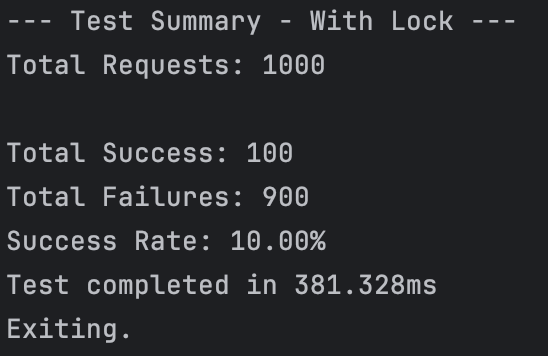
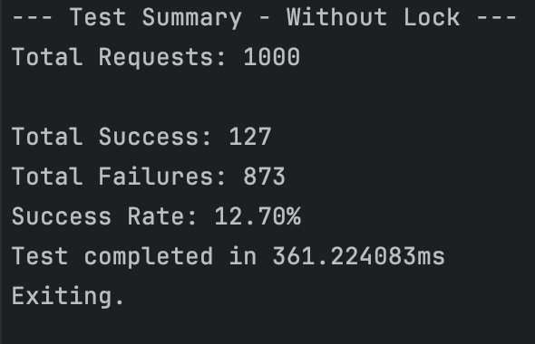

# Ecommerce Project Structure

```plaintext
ecommerce/
│
├── cmd/
│   ├── app/
│   │   └── main.go
│   └── test/
│       └── test.go
│
├── config/
│   ├── pg.go
│   └── redis.go
│
├── internal/
│   ├── auth/
│   ├── order/
│   ├── product/
│   └── user/
│
├── routes/
│   ├── order_route.go
│   ├── product_route.go
│   └── user_route.go
│
├── utils/
│   ├── hash.go
│   └── util.go
│
├── .env
├── .gitignore
└── go.mod
```

# With Pessimistic Lock


# Without Pessimistic Lock
