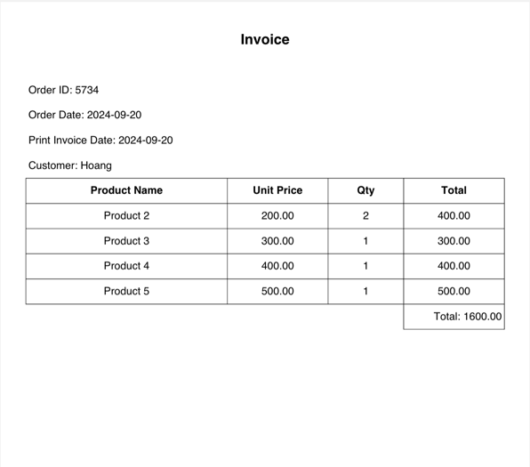

# Print Invoice Feature
## Results
- [x] Implement the `Print Invoice` feature in the `OrderHandler` to generate and download a PDF invoice for a specific order.

## Overview

The "Print Invoice" feature allows users to generate and download a PDF invoice for a specific order. This feature is implemented in the `OrderHandler` and utilizes the `InvoiceService` to gather the necessary data and the `GenerateInvoicePDF` function to create the PDF.

## Implementation Details

### OrderHandler

The `OrderHandler` is responsible for handling HTTP requests related to orders. The `PrintInvoice` method in the `OrderHandler` handles the request to generate and download the invoice PDF.

#### PrintInvoice Method

```go
func (h *OrderHandler) PrintInvoice(w http.ResponseWriter, r *http.Request) {
    orderId := utils.StrToInt(r.URL.Query().Get("order_id"))
    invoiceData, err := h.InvoiceService.GenerateInvoiceData(orderId)
    if err != nil {
        http.Error(w, "Failed to generate invoice data", http.StatusInternalServerError)
        return
    }

    pdfBytes, err := orderUtils.GenerateInvoicePDF(*invoiceData)
    if err != nil {
        http.Error(w, "Failed to generate PDF", http.StatusInternalServerError)
        return
    }

    w.Header().Set("Content-Type", "application/pdf")
    w.Header().Set("Content-Disposition", "attachment; filename=invoice.pdf")
    w.Write(pdfBytes)
}
```
